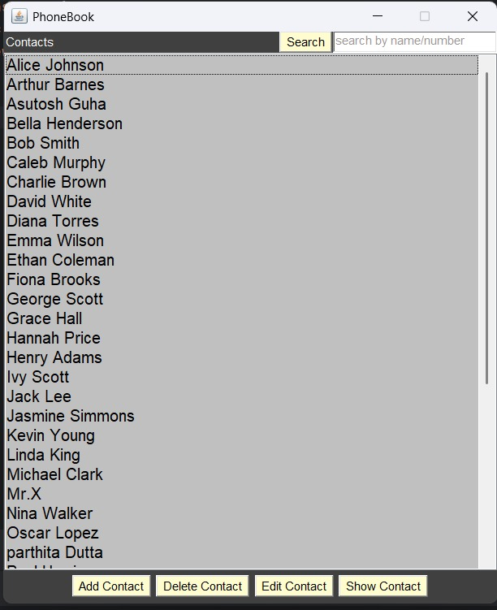
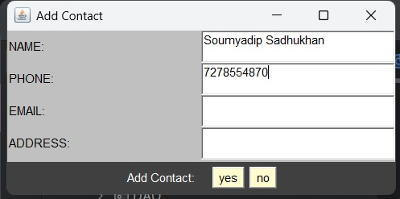
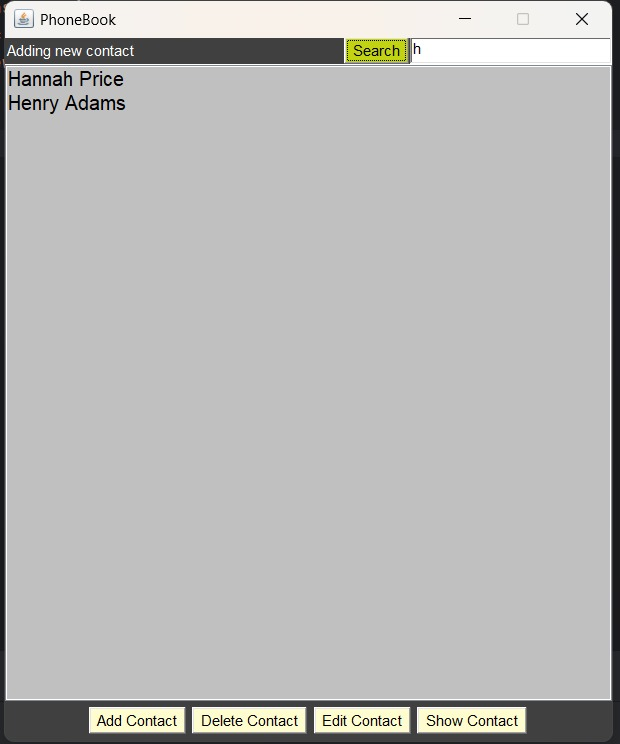
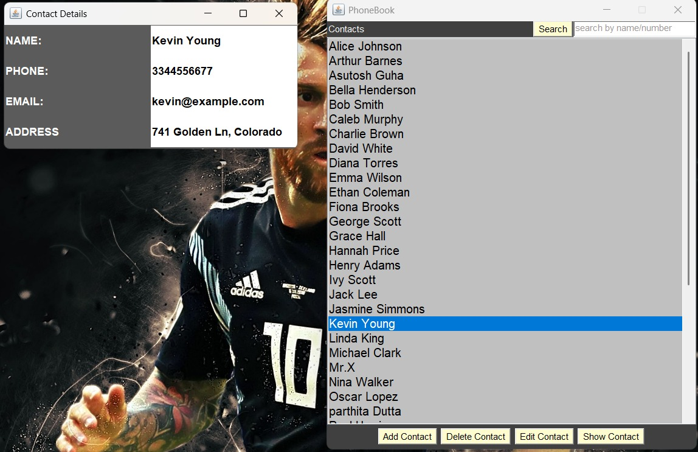

🔍 Project Overview
Project Name: PhoneBook

Language: Java

UI Toolkit: AWT (Abstract Window Toolkit)

Database: Oracle SQL (via JDBC)

Architecture: Follows a modular structure with DAO (Data Access Object), model, and UI layers.

📂 Project Structure

PhoneBook/
├── src/
│   ├── main.java                       # Entry point of the application
│   ├── DAO/
│   │   ├── ContactService.java        # Handles all database operations
│   │   └── DBConnection.java          # Handles Oracle DB connectivity
│   ├── model/
│   │   └── Contact.java               # POJO for contact information
│   └── UI/
│       ├── ContactApp.java            # Main UI frame
│       ├── AddContactFrame.java      # Add new contact UI
│       ├── EditContactFrame.java     # Edit contact UI
│       ├── DeleteContactFrame.java   # Delete contact UI
│       └── ShowContactFrame.java     # Display all contacts UI
├── .idea/                             # IntelliJ IDEA config files
├── out/                               # Compiled class files
├── PhoneBook.iml                      # IntelliJ module file
└── Structure.docx                     # Project documentation (not analyzed here)

🧠 features
    Add, edit, delete, and view contacts
    UI built with Java AWT
    Oracle Database used to store contact details
    Proper separation of concerns using DAO and model layers

UI:-

🛠 Requirements
    JDK: 8 or higher
    Oracle Database with a proper connection string
    ojdbc14.jar: Oracle JDBC driver (already referenced in .idea/libraries/)

Database Schema:-
    CREATE TABLE CONTACTS (
        ID NUMBER GENERATED BY DEFAULT AS IDENTITY,
        NAME VARCHAR2(100),
        PHONE_NUMBER NUMBER(15),
        EMAIL VARCHAR2(100),
        PRIMARY KEY (ID)
    );

🚀 How to Run
Clone or Download the Project

git clone https://github.com/Soumyadip010/Phonebook.git
cd PhoneBook
Configure Oracle DB Connection

Update the database URL, username, and password in DBConnection.java.

||Compile the Project||
    javac -d out/production/PhoneBook src/**/*.java

||Run the Application||
    java -cp out/production/PhoneBook main

📌 Notes
    Ensure Oracle Database is running before starting the app.
    The application stores contact numbers as BigDecimal to handle very large values.
    UI is minimal as it's based on AWT but functionally complete.
